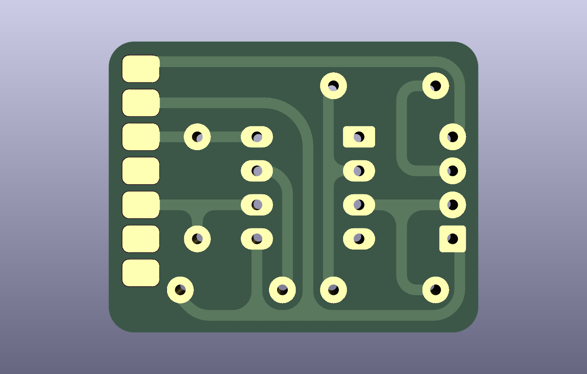

# DIN-MIDI-XIAO-PCB




DIN MIDI PCB for Seeed Studio XIAO format boards - designed for CNC milling

Pinout:

-   Pin 1 -> GND
-   Pin 2 -> MIDI- / 5
-   Pin 3 -> MIDI+ / 4
-   Pin 4 -> +5V

Pin 1 and 4 are for powering the XIAO board, only connect them when USB is not.

```c++
#include <HardwareSerial.h>
#include <MIDI.h>

#define MIDI_IN 8 // pin 8 for XIAO ESP32S3 - change to your pin

MIDI_CREATE_INSTANCE(HardwareSerial, Serial1, MIDI)

void setup()
{
    Serial.begin(115200); // for debugging
    Serial1.begin(31250, SERIAL_8N1, MIDI_IN, -1); // for MIDI input
    MIDI.begin(MIDI_CHANNEL_OMNI);
}

void loop()
{
    MIDI.read();
}
```
